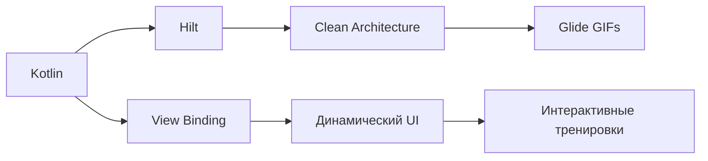

# 📚 EngDictionaryApp: Учим английские слова весело! 🎉

👋 Это интерактивное приложение для изучения английских слов, где скучные словари уступают место динамичному обучению с мгновенной обратной связью. Учи слова играючи! 🚀

## 🔥 Что внутри? Stack:


### 🌟 Изюминки реализации:
- **🎯 Dagger Hilt** для элегантного DI - [официальный гайд](https://dagger.dev/hilt/)
- **🎨 Живой UI** с программной сменой цветов и анимаций
- **📊 Умный алгоритм** тренировок (4 варианта ответа, адаптивная сложность)
- **🎉 Праздничный финал** с анимированным GIF-поздравлением 🎊
- **🌍 Поддержка локализации** (русский/английский)

### 📚 Библиотеки, которые заслуживают внимания:
- **🖼️ Glide** - [библиотека](https://bumptech.github.io/glide/) для плавной загрузки GIF-анимаций
- **✏️ Кастомные шрифты** - [Nunito](https://fonts.google.com/specimen/Nunito) и [Rubik](https://fonts.google.com/specimen/Rubik)
- **🎭 Shape Drawables** - динамические фоны с программной подстройкой

## 🗂️ Структура проекта - где что лежит

```
app/
├── src/main/
│   ├── java/com/example/engdictionaryapp/
│   │   ├── di/               🧪 # Модули DI (Hilt)
│   │   ├── init/             🚀 # Запуск приложения
│   │   ├── models/           📦 # Сердце данных
│   │   ├── trainer/          🧠 # Мозг обучения
│   │   │   ├── data/         🗃️ # Работа с данными
│   │   │   └── domain/       ⚙️ # Логика тренировок
│   │   ├── ui/               🎨 # Визуальные компоненты
│   │   ├── app/              📱 # Ядро приложения
│   │   └── MainActivity.kt   🔌 # Главный экран
│   ├── res/
│   │   ├── drawable/         🖼️ # Иконки и GIF-анимации
│   │   ├── font/             ✒️ # Красивые шрифты
│   │   ├── layout/           🖌️ # Макеты интерфейса
│   │   ├── raw/              📖 # Словарь в JSON
│   │   └── values/           🌈 # Ресурсы и локализация
└── build.gradle              🛠️ # Конфигурация сборки
```

### Ключевые компоненты:
- **`trainer/domain`** - здесь рождается магия! ✨ Алгоритмы генерации вопросов и отслеживания прогресса
- **`ui/`** - оживляем интерфейс: меняем цвета, анимации, состояния
- **`res/raw/`** - словарь с 500+ словами для обучения (легко расширяется!)
- **`di/`** - элегантное управление зависимостями через Hilt

## 📸 Живые скриншоты

| Главный экран | Правильный ответ | Завершение обучения |
|---------------|------------------|---------------------|
|  |  |  |

*Интерфейс полностью адаптивен и работает на любых устройствах! 📱💻*

## 💡 Почему это круто?
- **🎮 Игровой подход** к изучению слов
- **📈 Реальная статистика** прогресса
- **🎭 Эмоциональная обратная связь** (радость при правильных ответах 💖)
- **🧩 Чистая архитектура** с разделением ответственности

Проект идеально подходит для изучения современных Android-практик или как основа для собственного обучающего приложения! 🚀

> "Учиться должно быть весело - и этот проект доказывает это!" 😄
